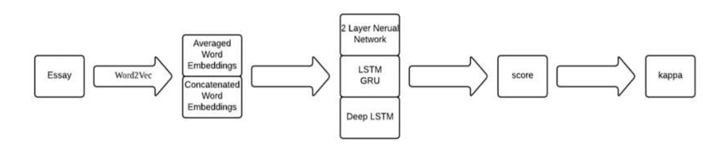
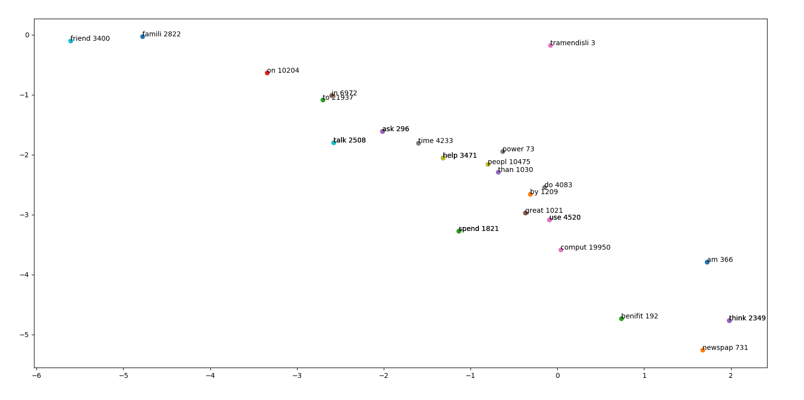
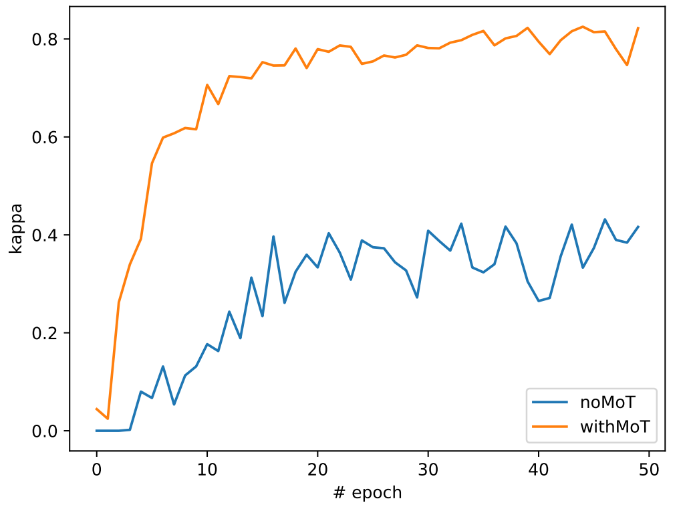
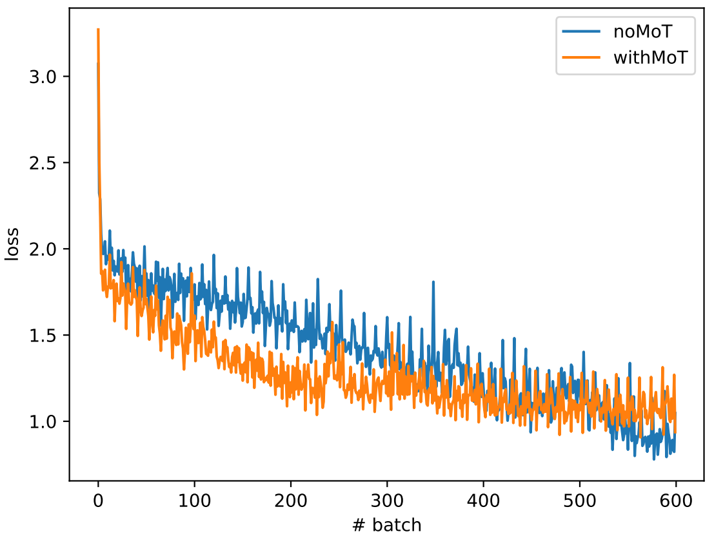

# Automated Essay Scoring (AES) with LSTM

## Introduction
As the number of international students increases year by year, the demand of essay grading in standard tests, like TOEFL, GRE and
GMAT, has grown at the same time. 

In 2012, the Hewlett Foundation sponsored a competition on Kaggle called the [Automated Student Assessment Prize (ASAP)](https://www.kaggle.com/c/asap-aes). The competition used quadratic weighted kappa (QWK) to measure the similarity between the human scores and the automated scores. The winner of the competition achieved the kappa score of 0.81407.

However, most of the models by then were built with predefined features without machine learning features. With the fast development of machine learning in recent years, we want to construct a neural network model to solve the problem.

<!-- Basic structure of LSTM model:
<p align="center">
    <br/>
    <em>Basic structure of LSTM.</em>
</p> -->

## Task description and Data set
Our goal is to build a model which takes in an essay and automatically return a score of that essay. We need to extract characteristics form the essays and build a multiclassification model that can grade each essay as close to the hand grade as possible.

The ASAP competition provides 8 sets of essays, on average containing 1783 essays per set. The average word length of each essay ranges 150 ~ 750. And each essay has a score in range 2~12 which is hand graded by two graders. All identifying information from the essays, such as person, organization, location, date and so on, has been replaced with a string like “@PERSON”.


## The description of the model

The general work flow is shown here:
<p align="center">
    <br/>
    <em>The work flow.</em>
</p>

We applied NLTK package for preprocessing, including word stemming and tokenization. Then we applied Word2Vec for word embedding, which consists of CBOW and Skip-Gram and outputs the vector of the words by unsupervised learning. The embedding size is chosen to be 10. The following is an illustration of the embedded word vectors projected onto 2D space:
<p align="center">
    <br/>
    <em>The word vector projected onto 2D space. Words have been stemmed. The number is the frequency of the word.</em>
</p>
It can be observed that, even after projection, the similar words, eg. {'in', 'to', 'on'}, {'friend', 'famili'} are located closely.

### Model selection

The baseline model is XGboost, `xgb_classify.py`. It reaches a kappa score of 0.71. Then we have tested several RNN models, including LSTM, GRU, bidirectional LSTM, LSTM_block and LSTM_LN which has layer normalization. However the kappa score remains to be around 0.5, worse than the baseline model.

To deal with this degraded behaviour, we seek to customize the vanilla LSTM model. We found the paper [A Neural Approach to Automated Essay Scoring](https://www.aclweb.org/anthology/D16-1193.pdf), which focuses on the same task. We noticed that the mean-over-time (MoT) pooling layer has been added on top of the outputs over the time sequence of the vanilla LSTM model. We think this is helpful to solve our problem. We added the MoT layer, the performance increases significantly. The QWK kappa score reaches **0.80**. 

The parameters:
```Python
LEARNING_RATE = 0.01
BATCH_SIZE = 128
DROPOUT = 0.5 # the keep_prob
N_EPOCHS = 50
hidden_size = 32 # the dimension of the hidden layer
```
We use 2-layer LSTM cell.

<p align="center">
    <br/>
    <em>The comparison of the kappa score (QWK) between two-layer LSTM w/ and w/o MoT layer on the testing set.</em>
</p>

<p align="center">
    <br/>
    <em>The comparison of the loss function between two-layer LSTM w/ and w/o MoT layer.</em>
</p>


## Usage


## Result
